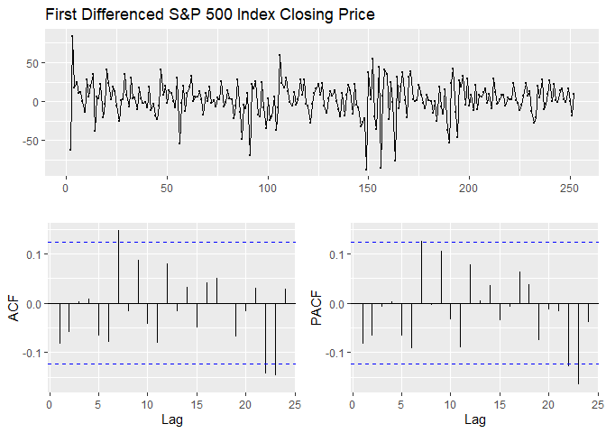
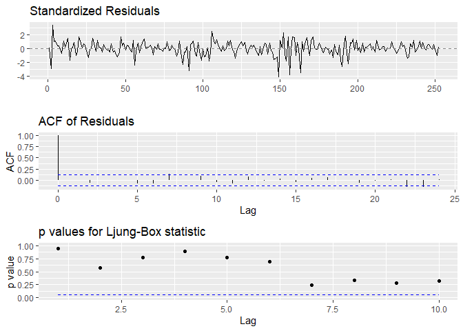
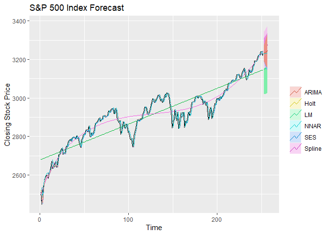
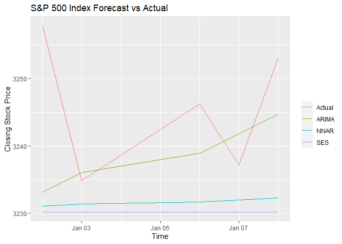

# S&P 500 Index Analysis & Forecast

Introduction
============

In this project, we seek to inspect a well-known time series, the S&P
500 Index, to identify trends and attempt to make a future forecast.

Abstract
--------

Using one year of historical closing price values from the S&P 500
Index, we attempt to fit a variety of models and analyze the trends.
From the portmanteau test on the original data, we could say that the
data is not generated from a random noise process at the 5% level. Thus
it was reasonable to continue trying to apply different models. To
remove an upward trend, the data was differenced, we could no longer
reject the null hypothesis that the series is a white noise process.

Using cross-validation, we identified the top ARIMA models to model this
sequence using RMSE and AIC as metrics. The best model by this criteria
is ARIMA(1, 1, 0). Using this model, we attempt to predict the next 5
closing price values and demonstrate the comparison to the actual
values.

In addition to ARIMA, we tried to model the data using a variety of
linear and nonlinear techniques, including exponential smoothing, Holt
linear trend, cubic splines, and a feed-forward Neural Network. However,
the ARIMA(1,1,0) model remained as the superior model by RMSE.

Data
----

Yahoo! Finance - [S&P 500 (^GSPC)](https://finance.yahoo.com/quote/%5EGSPC/)

The S&P 500 Index is a collection of some of the largest US stocks from
a variety of industries, weighted by their market capitalization. A
closing price is the last price at which the stock was trading during
the previous trading day. In the case of the S&P 500, this is the last
weighted calculation of the index for the trading day, calculated at 4PM
ET/EDT. In this report, we use the S&P 500 index closing price for
January 1, 2019 to December 31, 2019 for model training, and January 2
to January 8, 2020 for model prediction.

The data source is Yahoo Finance, which we used because it is a free,
trusted source for accurate stock data. We used the quantmod package
(Quantitative Financial Modelling & Trading Framework for R) which has
an API for importing the data from Yahoo.

The S&P 500 is superior to individual stocks for modeling, as it is an
aggregate – this allows us to obtain a “big picture” in comparison to
individual stocks, which are more volatile and subject to more extreme
fluctuation. Our motivation for using this data was to obtain a
prediction model based on historical price data. Such a model would not
only be useful for profiting from market trades, but also as an
indicator for US stock movement, and therefore GDP growth and economic
sentiment. Of course, a simple model would be unlikely, so we used
methods such as Neural Networks to model the data.

# Setup

``` r
library(forecast)
library(ggfortify)
library(quantmod)
library(gtools)
library(parallel)
library(doSNOW)
library(tcltk)
options('getSymbols.warning4.0' = F)
GSPC <- getSymbols('^GSPC', from = '2019-01-01', to = '2020-01-01', auto.assign = F)
sp500 <- ts(GSPC$GSPC.Close)
```

Analysis
========

We aim to predict the daily closing values of The S&P 500 Index from
2020–01–02 to 2020–01–08. In this case, we will use one year of S&P 500
historical closing price values from 2019–01–01 to 2019–12–31, which can
be accessed through yahoo finance.

Time Series Plot
----------------

``` r
ggtsdisplay(sp500, main = 'S&P 500 Index Closing Price')
```


The time series plot shows an increasing linear trend with no obvious
seasonality. ACF plot shows a very slow decay in time suggesting that
the series might not be stationary and PACF cuts off at lag 1. \#\#\#
Portmanteau Test

``` r
Box.test(sp500, lag = 12, type = 'Box-Pierce')
```

    ## 
    ##  Box-Pierce test
    ## 
    ## data:  sp500
    ## X-squared = 1990, df = 12, p-value < 2.2e-16

The p-value of the portmanteau test for residuals is less than 0.05.
Therefore, we have sufficient evidence to reject the null hypothesis
that the series is white noise.

Then, to make the series stationary, we compute the differences between
consecutive observations.

First Differenced Time Series Plot
----------------------------------

``` r
sp500 %>% diff() %>% ggtsdisplay(main = 'First Differenced S&P 500 Index Closing Price')
```



The differenced series plot shows variation without an apparent trend.
Although both ACF and PACF plots show significant values at lag 7, 22,
and 23, they drop to zero quickly and most of the values are not
significant. Based on that, we could probably conclude that the series
is a white noise process.

### Portmanteau Test

``` r
sp500 %>% diff() %>% Box.test(lag = 12, type = 'Box-Pierce')
```

    ## 
    ##  Box-Pierce test
    ## 
    ## data:  .
    ## X-squared = 16.506, df = 12, p-value = 0.1692

The p-value of the portmanteau test for residuals is greater than 0.05.
Therefore, we do not have sufficient evidence to reject the null
hypothesis at 5% significant level, so we cannot conclude that the
differenced series is not a white noise process.

Modeling
========

In the next part, we will use four different forecasting techniques:
Regression, Exponential Smoothing, Box-Jenkins Methodology, and
Feedforward Neural Network.

Regression
----------

### Linear Regression & Cubic Spline

Since our time series data has a linear trend, we will try to model it
using a trend variable.

``` r
tslm_linear <- tslm(sp500 ~ trend)
t <- time(sp500)
t1 <- ts(pmax(0, t - 37))
t2 <- ts(pmax(0, t - 205))
tslm_spline <- tslm(sp500 ~ t + I(t^2) + I(t^3) + I(t1^3) + I(t2^3))
spline_new_data <- data.frame(t = t[length(t)] + seq(5),
                              t1 = t1[length(t1)] + seq(5),
                              t2 = t2[length(t2)] + seq(5))
```

As we can see the series is not exactly linear so it might be better to
use a non-linear regression like cubic spline.

### Five-step Time Series Cross-Validation

We will not be doing CV for cubic spline due to the unknown knots for
each training fold.

``` r
e_linear <- tsCV(sp500, function(x, h) { forecast(tslm(x ~ trend), h = h) }, h = 5)
rmse_linear <- sqrt(mean(e_linear^2, na.rm = T))
```

Exponential Smoothing
---------------------

### Simple Exponential Smoothing & Holt’s linear trend method

We will use this method because it is suitable for forecasting data with
no clear seasonal pattern. Since there is no training required, we will
only do model performance evaluation here.

### Five-step Time Series Cross-Validation

``` r
tsCV_ses <- tsCV(sp500, ses, h = 5)
rmse_ses <- sqrt(mean(tsCV_ses^2, na.rm = T))
tsCV_holt <- tsCV(sp500, holt, h = 5)
rmse_holts <- sqrt(mean(tsCV_holt^2, na.rm = T))
```

Box-Jenkins Methodology
-----------------------

### Five-step Time Series Cross-Validation for ARIMA Model Selection

We will use a five-step time series cv to measure the goodness of
prediction for all possible models (ARIMA(p, 1, q) where 0 \<= p \<= 4
and 0 \<= q \<= 4).

For every i = 1, …, 251:

1.  Train the model on every point before i

2.  Compute the test error on the held out point i

3.  Average the test errors

To evaluate the effectiveness of our methods, we will use the root mean
square error (RMSE) and Akaike information criterion (AIC) metrics. For
both metrics, the lower the value, the better the prediction.

``` r
cl <- makeSOCKcluster(detectCores() - 1)
registerDoSNOW(cl)
order <- permutations(5, 2, 0:4, repeats = T)
order <- lapply(1:nrow(order), function(i) order[i, ]) # Convert matrix to list
pb <- tkProgressBar(max = length(order))
opts <- list(progress = function(n) setTkProgressBar(pb, n))
score <- foreach(pq = order, .options.snow = opts, .packages = c('forecast')) %dopar% {
  p <- pq[1]
  q <- pq[2]
  aic <- Arima(sp500, order = c(p, 1, q))$aic
  farima <- function(x, h) {
    forecast(Arima(x, order = c(p, 1, q)), h = h)
  }
  e <- tsCV(sp500, farima, h = 5)
  rmspe <- sqrt(mean(e^2, na.rm = T))
  return(c(p, q, aic, rmspe))
}
close(pb)
stopCluster(cl)
result <- data.frame(Reduce(rbind, score), row.names = NULL)
colnames(result) <- c('p', 'q', 'AIC', 'RMSE')
```

### Best ARIMA models based on RMSPE

``` r
print(result[order(result$RMSE)[1:4], ])
```

    ##    p q      AIC     RMSE
    ## 6  1 0 2277.979 35.82020
    ## 7  1 1 2279.671 36.12562
    ## 11 2 0 2279.444 36.54921
    ## 1  0 0 2277.018 36.55985

### Best ARIMA models based on AIC

``` r
print(result[order(result$AIC)[1:4], ])
```

    ##    p q      AIC     RMSE
    ## 13 2 2 2274.345 38.94127
    ## 1  0 0 2277.018 36.55985
    ## 2  0 1 2277.884 37.08191
    ## 6  1 0 2277.979 35.82020

Best model: ARIMA(1, 1, 0), because it has the lowest RMSPE, and an AIC
value that is very close to the second lowest.

### Fit best ARIMA model on the full training set

``` r
arima_model <- Arima(sp500, order = c(1, 1, 0), include.constant = T)
rmse_arima <- min(result$RMSE, na.rm = T)
```

### Residual Analysis

``` r
ggtsdiag(arima_model)
```



We can see that there is no pattern apparent in the residuals analysis
plot. The ACF values are not significant for lags other than 0. The
p-values for the Ljung-Box test are also large suggesting nothing
untoward about the fit of the model. Hence, we will use the ARIMA(1,1,0)
to forecast the next 5 closing price values of the S&P 500, which are
the closing values from 2020–01–02 to 2020–01–08.

Feedforward Neural Network
--------------------------

We will use a five-step time series cv to measure the goodness of
prediction for all possible models (NNAR(p,1) where 0 \<= p \<= 4)
similar to the previous CV for ARIMA

``` r
cl <- makeSOCKcluster(detectCores() - 1)
registerDoSNOW(cl)
order <- 1:4
pb <- tkProgressBar(max = length(order))
opts <- list(progress = function(n) setTkProgressBar(pb, n))
score <- foreach(p = order, .options.snow = opts, .packages = c('forecast')) %dopar% {
  fnnetar <- function(x, h) {
      set.seed(2020)
      forecast(nnetar(x, p, size = 1), h = h)
  }
  e <- tsCV(sp500, fnnetar, h = 5)
  rmspe <- sqrt(mean(e^2, na.rm = T))
  return(c(p, rmspe))
}
close(pb)
stopCluster(cl)
result <- data.frame(t(Reduce(rbind, score)[,2]), row.names = 'RMSE')
colnames(result) <- 1:4
print(result)
```

    ##             1        2        3        4
    ## RMSE 39.75401 47.29434 45.22063 53.00826

Best model: NNAR(1,1), because it has the lowest RMSE.

``` r
set.seed(2020)
nnar_model <- nnetar(y = sp500, p = 1, size = 1)
rmse_nnar <- min(result, na.rm = T)
```

Forecasting
===========

``` r
fcast_linear <- forecast(tslm_linear, h = 5, level = 95)
fcast_spline <- forecast(tslm_spline, newdata = spline_new_data)
fcast_ses <- ses(sp500, h = 5, level = 95)
fcast_holt <- holt(sp500, h = 5, level = 95)
fcast_arima <- forecast(arima_model, h = 5, level = 95)
fcast_nnar <- forecast(nnar_model, h = 5)
autoplot(sp500) + ggtitle('S&P 500 Index Forecast') +
  autolayer(fitted(tslm_linear), series = 'LM') + autolayer(fcast_linear, series = 'LM') +
  autolayer(fitted(tslm_spline), series = 'Spline') + autolayer(fcast_spline, series = 'Spline') +
  autolayer(fitted(fcast_ses), series = 'SES') + autolayer(fcast_ses, series = 'SES') +
  autolayer(fitted(fcast_holt), series = "Holt") + autolayer(fcast_holt, series = "Holt") +
  autolayer(fitted(fcast_arima), series = 'ARIMA') + autolayer(fcast_arima, series = 'ARIMA') +
  autolayer(fitted(fcast_nnar), series = 'NNAR') + autolayer(fcast_nnar, series = 'NNAR') +
  xlab('Time') + ylab('Closing Stock Price') + guides(colour=guide_legend(title = ' '))
```



CV RMSE Comparison
------------------

``` r
print(setNames(data.frame(rmse_linear, rmse_ses, rmse_holts, rmse_arima, rmse_nnar,
                          row.names = 'RMSE'),
               c('LM', 'SES', "Holt's", 'ARIMA', 'NNAR')))
```

    ##            LM      SES   Holt's   ARIMA     NNAR
    ## RMSE 74.69097 36.96683 42.11971 35.8202 39.75401

We can see that ARIMA has the lowest RMSE obtained from
cross-validation. We will now compare the top 3 model and Cubic Spline
using the test set.

### Evaluate MSE for Top 3 Models using the next 5 closing price values

``` r
GSPC <- getSymbols('^GSPC', from = '2020-01-01', to = '2020-01-09', auto.assign = F)
data <- GSPC$GSPC.Close
test <- as.vector(data)
rmse_test <- data.frame(rbind(accuracy(fcast_ses$mean, test),
                              accuracy(fcast_arima$mean, test),
                              accuracy(fcast_nnar$mean, test),
                              accuracy(fcast_spline$mean, test)),
                        row.names = c('SES', 'ARIMA', 'NNAR', 'Cubic Spline'))
print(rmse_test[order(rmse_test$RMSE), ])
```

    ##                      ME     RMSE       MAE        MPE      MAPE
    ## ARIMA          6.917322 12.31737  9.253049  0.2123299 0.2844937
    ## NNAR          14.147347 16.72466 14.147347  0.4351149 0.4351149
    ## SES           15.641849 17.97517 15.641849  0.4811633 0.4811633
    ## Cubic Spline -16.904491 21.74303 20.279535 -0.5216402 0.6252375

We can see that ARIMA has the lowest test RMSE score of 12.3. Cubic
Spline seems to have the worst performance here, this is not surprising
as it can still be further improved by using more knots or we can even
use smoothing splines instead so we would not need to optimize the
number of knots.

``` r
cbind(data.frame(fcast_arima), Actual = test)
```

    ##     Point.Forecast    Lo.95    Hi.95  Actual
    ## 253       3233.110 3189.373 3276.846 3257.85
    ## 254       3236.047 3176.761 3295.333 3234.85
    ## 255       3238.932 3167.224 3310.641 3246.28
    ## 256       3241.823 3159.560 3324.085 3237.18
    ## 257       3244.712 3153.102 3336.322 3253.05

We can see that all actual values are lying between the 95% prediction
confidence interval. Thus, the ARIMA(1,1,0) seems to perform well in the
prediction.

Forecast vs Actual
------------------

``` r
ggplot(data.frame(data), aes(x = index(data))) +
  geom_line(aes(y = GSPC.Close, color = 'Actual')) +
  geom_line(aes(y = fcast_arima$mean, color = 'ARIMA')) +
  geom_line(aes(y = fcast_nnar$mean, color = 'NNAR')) +
  geom_line(aes(y = fcast_ses$mean, color = 'SES')) +
  ggtitle('S&P 500 Index Forecast vs Actual') + xlab('Time') + 
  ylab('Closing Stock Price') + guides(colour = guide_legend(title = ' '))
```



Conclusion
==========

We set out to determine if there was a meaningful model that could be
found, which would be able to predict future stock prices of the S&P500
Index. In this project, we collected 252 observations from Yahoo Finance
API. The data represents the daily stock price from 2019–01–01 to
2019–12–31 (not including 104 days for the weekends when the exchange is
closed). We were also able to obtain the actual stock prices for the
first five weekdays of 2020 which we will attempt to forecast using the
data from 2019. The actual values compared to our forecasted values will
be used as a measure of the quality of our model.

Preliminary data exploration showed that the daily stock price of the
S&P500 Index was not a stationary series, the data plot showed an
obvious upward trend, without seasonality or periodicity. Moreover, the
ACF showed a significant correlation at all lag points. Ljung-Box
p-value was less than 0.05, therefore we rejected the null hypothesis
and concluded that the series was not a realization of a white noise
(stationary) process. Before further downstream analysis, we had to
transform the original, non-stationary, data series into a stationary
series.

The series was transformed using diff = 1, generate a new series. When
plotted, the new series data values showed no obvious trend. The ACF and
PACF plots show significant values at lag 7, 22, and 23. After doing the
Ljung-Box test (p-value greater than 0.05), we were unable to reject the
null hypothesis and concluded that the new series was indeed a
realization from a stationary process such that the significant values
in the ACF and PACF were likely to be outliers.

Next, we wanted to find the optimal model for forecasting. We started
with concepts we learned in previous Statistics classes, before moving
onward to key concepts taught in class. The first model we tried was a
simple linear regression model. The linear regression accurately
reflected the upward trend of the S&P500 Index data but was unable to
show more nuanced variations. Next, we tried a non-linear regression,
using cubic splines. While the cubic spline regression was a better fit,
we soon realized that cross-validation of a cubic spline model was
extremely tedious so we did not pursue the cubic spline model any
further.

From the concepts learned in class, we applied a simple exponential
smoothing method before upgrading to a Holt linear trend method. We
transitioned to a Holt approach since the S&P500 data showed no
seasonality but had an upward trend. These methods were contrasted with
the ARIMA modeling approach.

The ARIMA model was optimized by enumerated over possible values of p
and q (d = 1), constrained by p \>= 0 and p \<= 4, and q \>= 0, and q
\<= 4. The chosen model used ARIMA(1, 1, 0) because it has the lowest
RMSPE (30.92661), and AIC value (2277.979) was extremely close to the
second-lowest AIC (2277.018). Fitting the ARIMA(1,1,0) model to the full
dataset returned an alpha coefficient of -0.0849. Residual analysis on
the fitted model shows that the residuals follow a realization of a
white noise process, as expected from a good fitting model.

Finally, we tried a feedforward neural network (NN), using one node in
the hidden layer. We tuned the NN by taking the same values of p (p =
number of lags for a linear AR(p) model) as in our ARIMA model. Taking
the NN model with the lowest RMSE.

Each of the five models (less cubic spline) underwent a five-step
time-series cross-validation. This method calculates the difference
between the fitted values and the actual values from the holdout set
(five values in 2019) to calculate the RMSE of each model. From this
analysis, we found that the ARIMA(1,1,0) had the lowest RMSE and was
chosen as our best-fit model.

Using the ARIMA(1,1,0) model we forecasted the first five stock prices
from the year 2020. The actual values are shown to fall within the 95%
confidence interval of the forecasted values. As time increases into the
future, the confidence interval widens, as expected. Overall, we
conclude that an ARIMA(1,1,0) model is a good approximation for the
daily stock price of the S&P500 index for the year 2019. The
ARIMA(1,1,0) model is also accurate for forecasting purposes, up until
the first 5 weekdays of 2020.

During post-analysis, we looked at various years throughout the S&P500
data and realized that we had been extremely fortunate for selecting
2019 as our training dataset. The trends in other years were not as
clear and there is no guarantee that using other years as training would
yield an ARIMA(1,1,0) as the best-fitted model. Furthermore, the stock
market experiences various periods of extreme growth, stagnation, and
crashes, however, there was no such novel event during the year of 2019.
Taking into account these extenuating circumstances, it is extremely
unlikely that an ARIMA(1,1,0) would be the best-fitted model for the
S&P500 Index in general.

Moving forward, we would like to try to use the entire S&P500 Index
dataset from inception in 1926 until 2019. This may yield a more
accurate model of the S&P500 Index prices. However, even that model is
unlikely to be able to predict market crashes like what we are currently
experiencing due to the COVID-19 global pandemic. More sophisticated
models which can account for anomaly detection would be necessary in
order to generate a model which can accurately model the S&P500 Index.
